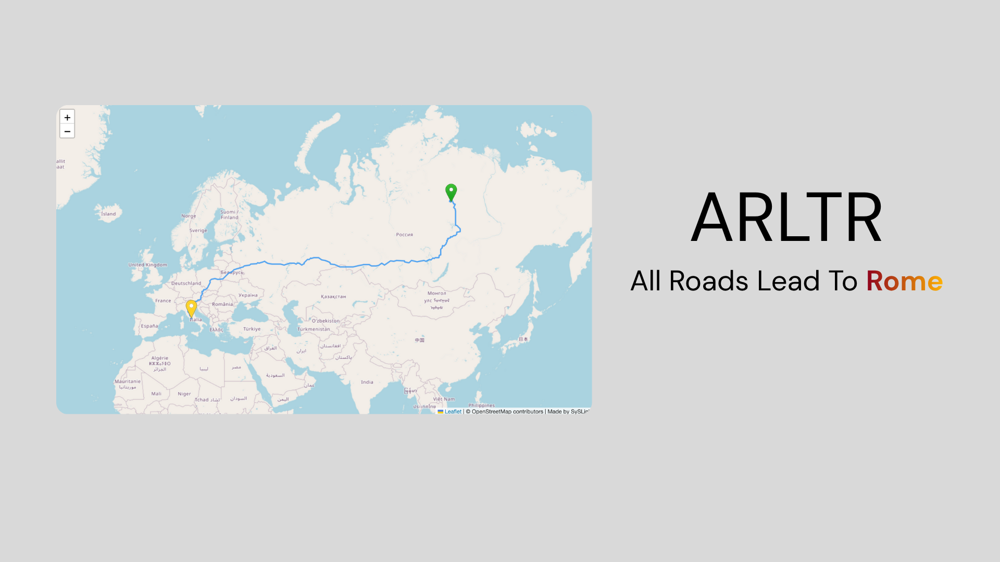
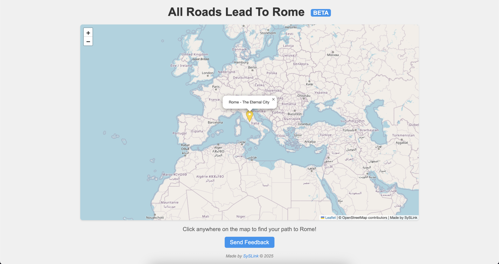
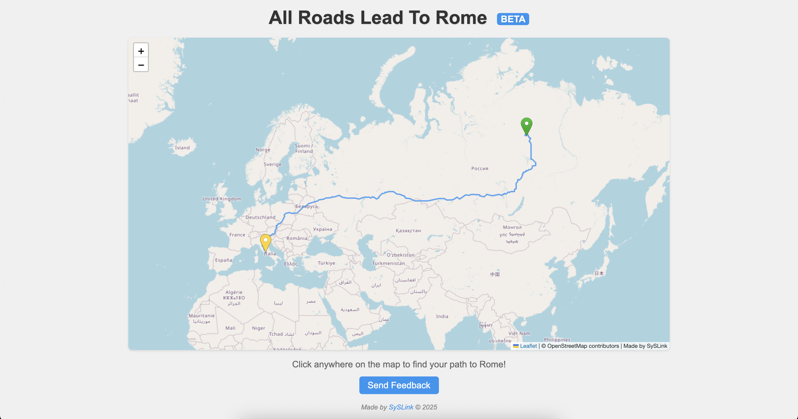

# arltr - all roads lead to rome

  

all roads lead to rome or whatever. try it if u want.

live site: [https://arltr.syslink.dev](https://arltr.syslink.dev)

## preview

  

  

## about

arltr just shows u a route to rome. click anywhere and it does its thing. land, sea, both… it picks whatever. blue lines for land, red dashed for sea. simple.

## how it works

click on the map, it drops a marker, calculates a route, done. handles boring overland stuff and random sea crossings automatically.

## customization

u can mess with everything in `config.js`:

* change destination coords + name
* change title, footer, whatever branding u want
* change colors and markers
* toggle features on/off
* adjust map zoom and boundaries

just edit the file. it updates. nothing fancy.

## contact

discord: [https://discord.gg/JWwYRNWBN4](https://discord.gg/JWwYRNWBN4)
made by syslink

## license

fork it if u want, just credit me.
